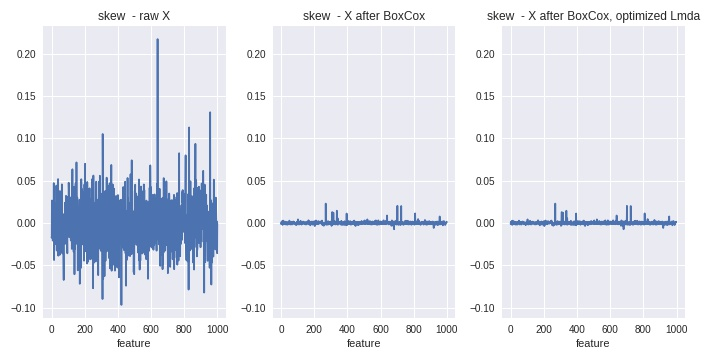

# Portfolio Project: Feature Selection + Classification using the Madelon dataset 

## Problem statement
Investigate feature selection techniques available to identify the most relevant features in datasets with a large feature space (high dimensionality), that cannot be handled using conventional machine learning techniques.

Feature selection is independent of the machine learning algorithm being used. Effective selection of a subset of features can have a significant impact on the quality of the results. This is especially true for high dimensional problems. 

Some of the benefits of using feature selection are: 

* It enables the machine learning algorithm to train faster.
* It reduces the complexity of a model and makes it easier to interpret.
* It improves the accuracy of a model if the right subset is chosen.
* It reduces overfitting.


## Goal

    1. Identification of most relevant features. 
    2. Demonstrate impact on prediction accuracy.

Two synthetically generated datasets will be used to investigate these techniques:

    1. The Madelon Dataset from UCI Machine Learning Repository. 
       This dataset has 500 features and is the canonical dataset for testing feature selection techniques.
    2. A larger synthetically generated Madelon dataset with 1000 features and 200,000 observations.    


## Highlevel approach
Fundamentally, this is a binary classification challenge. Using the two datasets of differing sizes, a suite of feature selection options will be developed, and their effectiveness will be compared using a variety of classification models. The aim is to identify the 'best' features and model for each dataset.


## Project scope and structure
0. EDA observations for each subset 
1. Establish prediction accuracy benchmarks for raw dataset
2. Implement 3 feature selection models
3. Model selection
4. "Best" Model build & conclusions


## Madelon Dataset

### UCI dataset

Synthetic dataset - from UCI Machine Learning Repository. This is the canonical dataset for testing feature selection techniques.  
[Madelon](https://archive.ics.uci.edu/ml/datasets/Madelon) 

MADELON is an artificial dataset containing data points grouped in 32 clusters placed on the vertices of a five-dimensional hypercube and randomly labeled +1 or -1. The five dimensions constitute 5 informative features. 15 linear combinations of those features were added to form a set of 20 (redundant) informative features. Based on those 20 features one must separate the examples into the 2 classes (corresponding to the +-1 labels). We added a number of distractor feature called 'probes' having no predictive power. The order of the features and patterns were randomized. 

Data available:

|MADELON         |Positive ex. | Negative ex. | Total | Check_sum   
|---------------:|------------:|-------------:|------:|-------------:
|Training set    | 1000        | 1000         | 2000  | 488083511.00    
|Validation set  |  300        |  300         |  600  | 146395833.00      
|Test set        |  900        |  900         | 1800  | 439209553.00     
|All             | 2200        | 2200         | 4400  |     

Number of variables/features/attributes: 
- Real: 20  -  5 of which are informative, 15 of which are linear combinations & are therefore redundant
- Probes: 480 
- Total: 500 

As there are no target labels available for the test data set we will combine the Training and Validation sets to provide 2600 observations. We will then create a Train/Test split. This process is explained in the benchmarking step.


### Extended Madelon Dataset (PostgresDB)

Extended Madelon dataset of 200,000 records with a 1000 features, plus one target column, is available from a GA postgres db hosted on an AWS instance 
    - database name = postgres
    - user name = postgtres
    - table name = madelon
    - AWS instance IP =###########
    
Number of variables/features/attributes: 
- Real: 20  -  5 of which are informative, 15 of which are linear combinations & are therefore redundant
- Probes: 980 
- Total: 1000 

As this is a much larger dataset we will randomly extract 3 samples from the database for the modeling process. To test the final model, we will go back to the database to select all 200,000 observations for the selected features.

Sample size required for...
        * 95% CI & 1% margin of error
            * 200,000 -> 9,164   =   4.58%
        * 90% CI & 1% margin of error
            * 200,000 -> 6,506    = 3.25%

3 random samples of 4.6% of total dataset will be used.

Sample acquisition is performed in a separate Jupyter notebook.
Notebook: 00-EDA-PostgresDB-dataset-Sample-extraction.ipynb


## 0. Exploratory Data Analysis

### UCI Dataset
Notebook: 00-EDA-UCI-dataset.ipynb

#### Shape & type of data

2600 Observations
    
Target (y):
  - Binary Target class = 1,-1 
  - The classes are evenly distributed in the available dataset.
    
Predictors (X):
  - 500 predictor features
  - All features are of type integer.
    
#### Explore Univariate distributions
First, we explore the distributions of each features. Let's look at the mean and standard deviation of each feature.


This graph shows us that the mean and std. of the majority of features are very similar. We have a small number of features with wider distributions (higher std.) and higher mean values.

To see this more clearly let's look at the density function for these attributes of the features.

    
This highlights the small number of features with distinct distributions. The plot on the right highlights the amount of skew in included in the features. 

These findings indicate the need for the following feature engineering:
  - A transformation process to remove/reduce the skew
  - Standard scaling to normalize the distribution  of each of the variables.

  
#### Explore Multivariate distributions - between features
First, we explore the relationship between features. It is difficult to visualize the relationship between large numbers of features, to do this we will look at the correlation between features and then at the principal components of the variance of the population of features.

##### Correlation between features. 

These plots look at the amount of correlation between feature pairs. From the density plot on the left we can see that the majority of feature pairs have very low correlation (a value of 1 implies high correlation). The plot on the right shows the feature pairs with the highest correlation. 

##### Principle Component Analysis (PCA)
PCA is a dimension reduction technique but if can also be used to visualize the strongest directions of variance in a multi-dimensional feature space.

Imagine of a swarm of bees where every bee is a feature and where their position at a point in space and time is a feature value (think travel path). The bees may be moving in many different directions and the path of an individual bee does not tell us much about the relationship between the travel paths of the bees. If you look at the direction of travel of the whole swarm you can identify the key axes of travel (principal components of variance) along which they are moving e.g. towards you, veering to the right, moving upwards. PCA seeks to identify these key axes (dimensions of variance) by identifying subsets of bees whose travel is driving the direction of the swarm. These subsets of bees (principal components) can be used to explain / predict the direction of the swarm allowing the other bees (features) to be dropped. The strength of the principal components is measured by how much of the variance in the feature population (swarm) they predict.

For the raw UCI dataset, the top 9 principle components reflect the following combination of features.


We can see a small number of features making the largest contribute to the first 5 principal components. However, the large number of 'noisy' features are still impacting the strength of the principle component features. This can be seen in by the low amount of the feature space variance that the first 5 principal components explain.


The feature selection process should remove the noisy features and we will revisit this analysis in the model selection process.

#### Explore Multivariate distributions - between features and target
High dimensional data is difficult to visualize, PCA can be used to try to identify any clustering of values. We will use the principle components that we calculated to try to identify any clustering of class values.


The graph shows some clustering => PC1 PC2 correlated to target. However, difficult to identify a clear relationship with the high level of noisy features. We will revisit this visualization after feature selection.

#### Missing Values treatment      
The dataset had one column that was empty where the target variables had been removed. This was removed during the data load process.

#### Feature engineering
As identified in the early analysis we need two preprocessing steps to ensure the data has a distribution that will not distort the modelling results.

1. De-skew data using the Box-Cox transformation. This uses the following logic to transform the X values.
```
y = (x**lmbda - 1) / lmbda,  for lmbda > 0
    log(x),                  for lmbda = 0
```
Note: The transformation requires that all values are greater than 0. A small constant is added to all values to ensure that this is true. 

If lambda = 0 the transformation is applied, item wise, to the whole dataset before further modeling (it is not sample dependent). 

For this data set,  applying lmda >0 has little impact on skew so it has been left as 0. 

(Note: A normal distribution has skew=0.)

The impact on the level of skew can be seen in the following plot.


2. Standard scaling to normalize the distribution of each of the variables. This is performed for each feature individually by subtracting the mean and dividing by the std. This process is sample dependent and is performed during the modeling process when the datasets are split for cross validation. 


### Postgres : Sample1 Dataset
Notebook: 00-EDA-postgres-sample1.ipynb

The same EDA process was performed for all 3 samples. Similar observations were made for all three samples. A summary of observations for Sample1 are provided in this report.

#### Shape & type of data

9206 Observations
    
Target (y):

- Binary Target class = 0 ,1 
- The classes are evenly distributed in the available dataset (4607=0 , 4599=1)
    
Predictors (X): 

- 1000 predictor features
- All features are of type float
    
#### Explore Univariate distributions

First, we explore the distributions of each features. Let's look at the mean and standard deviation of each feature.


Similar to the UCI dataset, this graph shows the mean and std. of the majority of features are very similar. We have a small number of features with wider distributions (higher std.) and higher mean values. To see this more clearly let's look at the density function for these attributes of the features


This highlights the small number of features with distinct distributions. The plot on the right highlights the amount of skew in included in the features. 

As with the UCI dataset these findings indicate the following feature engineering:- 
  - A transformation process to remove/reduce the skew
  - Standard scaling to normalize the distribution of each of the variables.

  
#### Explore Multivariate distributions - between features
First, we explore the relationship between features. As with the first dataset we will look at the correlation between features, then at the principal components of the variance.

##### Correlation between features. 

These plots look at the amount of correlation between feature pairs. From the density plot on the right we can see that the majority of feature pairs have very low correlation (a value of 1 implies high correlation). The plot on the left shows the feature pairs with the highest correlation. 

##### Principle Component Analysis (PCA)
For the raw Sample1 dataset the top 9 principle components reflect the following combination of features.

Again, we can see a small number of features make the largest contribute to the first 5 principal components. However, the large number of 'noisy' features are still impacting the strength of the principle component features. This can be seen by the low amount of the feature space variance that the first 5 principal components explain.


The feature selection process should remove the noisy features and we will revisit this analysis in the Model Selection process.

#### Explore Multivariate distributions - between features and target
As with the UCI dataset , we will use the principle components that we calculated to try to identify any clustering of class values.

The graph shows some clustering => PC1 PC2 correlated to target. However, difficult to identify a clear relationship with the high level of noisy features. We will revisit this visualization after feature selection.

#### Missing Values treatment   
The dataset had no missing values.

#### Feature engineering
As identified in the early analysis we do need two preprocessing steps to ensure the data has a distribution that will not distort the modelling results.

1. De-skew data using the Box-Cox transformation. ( process as detailed for UCI dataset.)

As for the UCI dataset - applying lmda >0 has little impact on skew so it has been left as 0. 


2. As for the UCI dataset  - Standard scaling to normalize the distribution of each of the variables is required.  This process is sample dependent and is performed during the modeling process when the datasets are split for cross validation. 
  

## 1. Establish Benchmarks
Notebook: 01-Benchmarking.ipynb

We will use 4 different classification models against which to benchmark the effectiveness of the feature selection and hyperparameter tuning process. 

### Models to use:
    - logistic regression
    - decision tree
    - k nearest neighbors
    - support vector classifier (svc)

We will the default hyperparameter of the models at this stage, as we want to establish a baseline performance for the feature selection options rather than tune the model hyperparameters at this stage. (NB: For the logistic regression and svc models we will set the hyperparameter C to a high value so that regularization is minimized - we will look at the impact of increasing regularization during the model selection process.)

### Metric to use:

In general, when assessing the effectiveness of a binary classification model we are concerned with both:

* Sensitivity: proportion of positives that are correctly identified (e.g. percentage of sick people correctly identified as having the condition)

* Specificity: proportion of negatives that are correctly identified (e.g. percentage of healthy people correctly identified as not having the condition).

There are a number of different metrics that can be used depending of the focus of the particular problem statement. For this exercise we will use the standard metric 'accuracy' , focused on overall prediction accuracy.

Accuracy = proportion of 'True' results out of the total no of cases predicted ( both true positive and true negative)

Accuracy scores fall within the range of 0 to 1, with 1 reflecting high level prediction accuracy.

### Train / Test split
During the benchmarking process we will create two splits of the data:  
 * Train dataset = 80% - this will be used to identify our 'best' model
 * Test dataset = 20% - this data set will not be used until we test would final model.
 
The purpose of this is to keep a dataset aside so that we can test our final model knowing that it has not been influenced by the test data. This will give a better indication of how the model will perform on unseen data.

### Benchmark Scores

#### UCI dataset


#### Postgres Samples


The average benchmark test scores are well below 0.7 and tend to be significantly below the training scores, implying overfitting of the data. 

## 2. Feature Selection

There are 3 main approaches to feature selection. We will use an example of each of these to demonstrate the feature selection process.

### Filter approach
Filter models assess the relevance of features by looking only at the intrinsic properties of the data. In most cases a feature relevance score is calculated, and low-scoring features are removed. Afterwards, this subset of features is presented as input to the classification algorithm. 

Filter models can be either:
 - univariate - scoring features one at a time against the target
 - multivariate - use a similar approach but incorporate feature inter-dependencies,

#### Univariate filter
Advantages: 
  - Fast
  - Scalable 
  - Independent of classifier
 
Disadvantages: 
  - Ignores feature dependencies
  - Ignores classifier

#### Multivariate filter
Advantages: 
  - Models feature dependencies
  - Independent of classifier
  - Better computational complexity than wrapper method (avoids overfitting)
  
Disadvantages: 
  - Slower than univariate methods
  - Less scalable than univariate methods
  - Ignores classifier

Sklearn offers univariate feature filter as a class named SelectKBest which we will use for one of our models. 


### Wrapper approach
Wrapper models setup a search procedure in the space of possible feature subsets. Various subsets of features are generated and evaluated by training and testing a specific classification model. To search the space of all feature subsets, a search algorithm is ‘wrapped’ around the classification model. However, as the space of feature subsets grows exponentially with the number of features, heuristic search methods are used to guide the search for an optimal subset. These search methods can be divided in two classes: deterministic (will always produce the same outcome) and randomized search algorithms. 

#### Deterministic search methods
Advantages: 
  - Simple
  - Interacts with classifier
  - Models feature dependencies
  - Less computationally expensive than randomized models

Disadvantages: 
  - Risk of overfitting
  - More prone than randomized algorithms to getting stuck in local optimum greedy search)
  - Classifier dependent selection

#### Random search methods
Advantages: 
  - Less prone to local optima
  - Interacts with classifier
  - Models feature dependencies
  
Disadvantages: 
  - Computationally expensive
  - Classifier dependent selection
  - Higher risk of overfitting than deterministic mode

Sklearn offers a wrapper model with a deterministic search method as a class named RFE (Recursive Feature Elimination) which we will use for one of our models.

### Embedded type
Embedded models use the search for an optimal subset of features built into a classifier construction. Just like the wrapper approach, embedded approaches are specific to a given learning algorithm, but embedded methods have the advantage that they are far less computationally intensive than wrapper methods. 

Advantages: 
  - Interacts with classifier
  - Models feature dependencies
  - Better computational complexity than wrapper models

Disadvantages: 
  - Classifier dependent selection
  
Sklearn offers an embedded model feature selector as a class named SelectFromModel which we will use for one of our models.


### Implementation

For each of these models we will create a pipeline that will run within a gridsearch with 5 cross validations. 

A gridsearch enables the pipeline to be run multiple times with different combinations of hyperparameters.

Cross validations involve randomly splitting the data set into train and validation sets and running the model on each split of the data. The "train" data is used to 'fit' the model and the 'validation' data is used to test the effectiveness of the model. By running the model on multiple splits of the data we can use the mean scores to ensure the model will generalize to other data.  

Each step in the pipeline...
 - takes the data output from the previous step
 - applies the model in the step to fit and transform the data
 - passes the transformed data onto the next step.
...the final step must be an estimator.

The pipeline for each model will contain
  - step1: apply Standard Scaling
  - step2: feature selection model
  - step3: classification model to assess effectiveness of feature selection

We will use each of the naive benchmark models to score the features selected by each feature selection model. The results from these models will be assessed in the model selection process.

#### SFM -  SelectFromModel
Notebook: 02-Feature-Selection-SelectFromModel.ipynb

Hyperparameters:
  - threshold: [.25,.3,.4,.45,.5,.6] (this was an iterative process to find the threshold that reduced the feature set to the desired size)
  - estimator = a Classifier - LogisticRegression()
    - Set penalty ='l1' (Lasso).
    - Set solver ='liblinear' (required for the Lasso penalty).
    - try range of C = cnp.logspace(1,3,3)


#### SelectKbest
Notebook: 02-Feature-Selection-SelectKBest.ipynb

Hyperparameters: 
   - k threshold: 
        - number of features to select and pass to next method (based on lowest pvalues). 
        - looking for 5 informative and 15 redundant features so we will try a range of values k = [5,10,15,20]
   - scoring function: 
        - f_classifi - used for classification problems with categorical target and continuous  features
        - function used to calculate pvalues of ANOVA F-test. 
        - low pvalue implies => reject null hypothesis (null hypothesis = feature and target are not statistically different)

#### RFE (Recursive Feature elimination)
Notebook: 02-Feature-Selection-RFE.ipynb

Hyperparameters:
  - Estimator: 
      - LogisticRegression - estimator needs to provide feature importance or coeff.
           - penalty=l1 . (l1 regularization allows coeffs to go to zero)
           - C regularization  strength  - try [10,100,1000] (small c= high regularization)
  - n-features_to_select -  try [5,10 ]

The range of parameters had to be restricted due to long runtimes.

The disadvantages of this model were evident with the larger sized datasets from postgresDB. This model failed to complete for these datasets - further tuning and a different choice of estimator may have helped.


## 3. Model assessment
Notebook: 03-Model-Selection_UCI.ipynb
Notebook: 03-Model-Selection_Postgres.ipynb

### Model assessment process

1. Review the results of the feature selection process and identify the set(s) of 'best' features for the final model for both the UCI and postgres datasets.

2. Re-run PCA model and assess whether to include in model assessment.

3.  Using each of the 'best' feature set(s) run a gridsearch on each of the classification models used in the benchmarking assessment. 

#### Models: 
    - logistic regression
    - decision tree
    - k nearest neighbors
    - support vector classifier (svc)

Use the gridsearch process to 'tune' 
   - the selection of the best 'best' feature set
   - classification model hyperparameter settings
   - inclusion or exclusion of PCA as an additional preprocessing step

4. Review all the results from the model assessment process and determine final model specifications
   - best feature set
   - preprocessing - Scaling / PCA
   - classification model and parameter settings

### Feature Selection results

#### UCI Summary of results

The classification models used to score the feature selection have clearly influenced the 'best' feature selection. 

The following range of features were selected.


Looking across all sets we can see which features were selected most frequently.

As there is no way to clearly identify the top 5 or top 10 we will take three cutoff points based on the frequency of occurrence of a feature in a 'selected' set. Each of these 3 sets will be further assessed in the model assessment.

#### UCI best feature sets
All = [ 28,  48,  64, 105, 128, 153, 241, 281, 318, 323, 336, 338, 378,
            384, 433, 442, 451, 453, 472, 475, 493]

Frequency > 8
top 5 = [48, 105, 128, 338, 378]

Frequency >6
top 10= [28, 48, 105, 128, 241, 336, 338, 378, 433, 451]

#### Postgres Samples - Summary of results

The classification models used to score the feature selection have clearly influenced the 'best' feature selection. 

The following range of features were selected.


Looking across all sets we can see which features were selected most frequently. 

As there is no way to clearly identify the top 5 or top 10 we will take three cutoff points based on the frequency of occurence of a feature in a 'selected' set. Each of these 3 sets will be further assessed in the model assessment.

#### Postgres Samples best feature sets
All = [257, 269, 315, 336, 341, 395, 494, 504, 526, 646, 667, 681, 701,
            724, 736, 769, 808, 829, 867, 920]

Frequency > 10  ( actually 10 features)
top 5 = [269, 315, 341, 681, 701, 736, 769, 808, 829, 920]

Frequency >8  ( actually 14 features)
top 10= [257, 269, 315, 336, 341, 504, 681, 701, 736, 769, 808, 829, 867,
            920]

### Review PCA 
#### UCI
The PCA model we looked at in the EDA process was rerun with the 'best' feature selection.


The top 2 principal components now account for nearly all the variance in the feature space. We will include PCA as an additional dimension reduction process to assess in the model assessment. 

There is some evidence of clustering of classes when looking at PC1 and PC2 correlation, but this is stll not very strong.

#### Postgres Samples


The top 5 principal components now account for nearly all the variance in the feature space. We will include PCA as an additional dimension reduction process to assess in the model assessment. 

There is some evidence of clustering of classes when looking at PC1 and PC2 correlation, but this is stll not very strong.

#### Model hyperparameter tuning
### UCI
The boxplot below shows a summary of the results of the model assessment and tuning.


Model with best mean test score:
  - Prepocessing = Standard scaling, do not include PCA
  - Best feature set = 21 features
  [ 28,  48,  64, 105, 128, 153, 241, 281, 318, 323, 336,338, 378, 384, 433, 442, 451, 453, 472, 475, 493]
  - Best model = KNeighborsClassifer
  - Best model parameters = n-neighbors=7

#### Postgres Samples
The boxplot below shows a summary of the results of the model assessment and tuning.


Model with best mean test score :
  - Preprocessing = Standard scaling , do not include PCA
  - Best feature set =  10 features
  [269, 315, 341, 681, 701, 736, 769, 808, 829, 920]
  - Best model = KNeighborsClassifer
  - Best model parameters = n-neighbors=9

## 4. Final Model Build
Notebook: 04-Build Model-UCI.ipynb
Notebook: 04-Build Model-Postgres_data.ipynb

Final model build based on specifications defined in step 3. Model assessment.

#### Process:
- Pipeline built for specified steps
- 5 fold Cross fold validation run on training data to fit 'final' model.
- Final model assessed by scoring Test data set aside in benchmarking step.

#### Results
Final model accuracy scores.


Cross validation scores are average scores for the 5 train/test data splits. 

#### Conclusions

The feature selection process successfully identified the 20 real features from the 500 UCI features and the 1000 Postgres features, resulting in significant improvements in model accuracy. 

The features selection process was not able to conclusively separate the 5 informative features from the 15 redundant features although some narrowing of the 20 features was achieved.

Further tuning of the n-neighbors parameter achieved additional improvements in model accuracy. 
